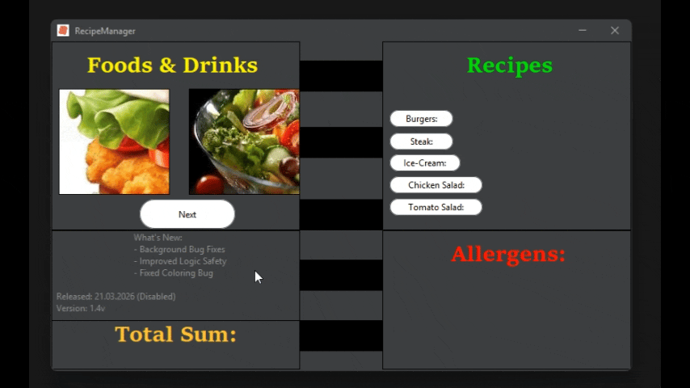
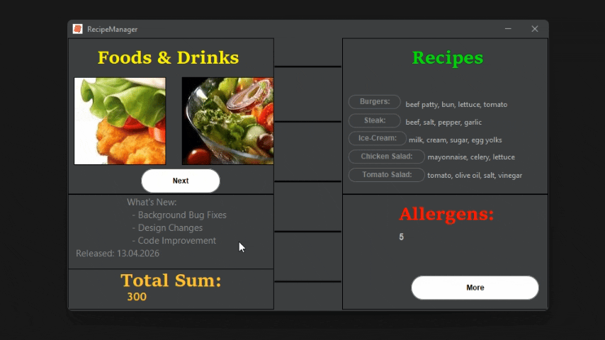
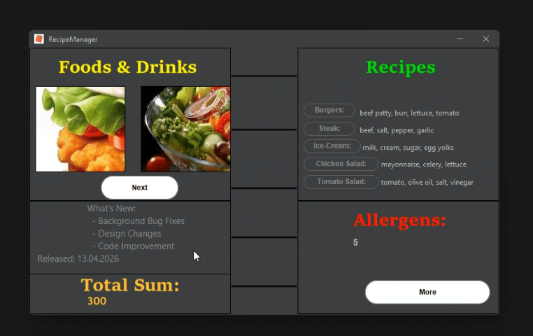
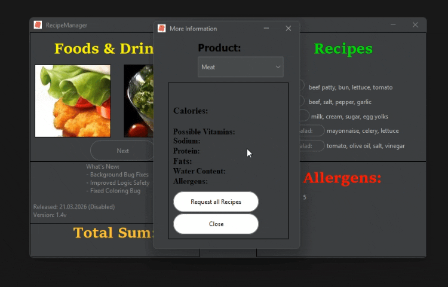

**RecipeManager is a small Desktop app which lets users select a few foods, check their Recipes and even request them.
this Application provides a basic example of how Restaurants can make simple and clear UI for their users to order a specific food.**

  # History of the RecipeManager:
   This development started in November of 2025, when one person in Java 'Help group' was searching for a help for their coursework.
   They had to build an App which lets users to behave like costumers to order a few food, But many helpers in group ignored their message for days and even didn't answer it for days.
   I reached out to them respectfully and started Development in early-November and finished it 3 days until the Deadline, October 30nd of 2025.
   But they have not reached out on that day, But They replied only on November 9th of 2025, about hand-over and they've said that what I have done is sufficient.
   I agreed on handing over, However I wanted to discuss a details, but after the last message of mine, they have not replied at all, its been 98 days.

  # How was the app made:
   RecipeManager is made trough the Java SE, it uses Java Swing (in-built framework for GUI, part of the Java Fundation Classes), for Components and window that you see, it uses FlatLaf library for a Better, Modern Look & Feel to the users. Java's Sound API is involved to handle the Sounds. Action Handling/Additional Features for GUI comes from Java AWT (Abstract Window Tookit) 
  ### How it ended up:
   the app now has became mine, I still maintain it up to this day and improve it gradually.
 
  **How to use RecipeManager:** 
    Make sure that you have a Latest JDK Installed -> Go to 'Download' folder in the Repo -> navigate to release folders -> Download jar files there and run it.
  ### License
This project is licensed under the GNU General Public License v3.0 (GPLv3) - see the LICENSE file for details. 
     **Important!**
      RecipeManager is NOT an Enterprise Project, It is a small, demonstrational app built for experience-gaining purposes.
      I had a specific goal to develop following App in this way. It is not intended for Enterprise operations, just portfolio-oritented build.

* Demonstration: 👇
* Startup loading bar 📶:
  
* Choose food products 🍔:
  
* Automatic Screen Cleanup 🧽:
  
* More Information Tab 📜:
  
* Sneaky Close Button Effect 📕:
  

  # RecipeManager development videos:
  [https://youtu.be/3FQSAhvBGP8 ](https://youtu.be/3FQSAhvBGP8)
