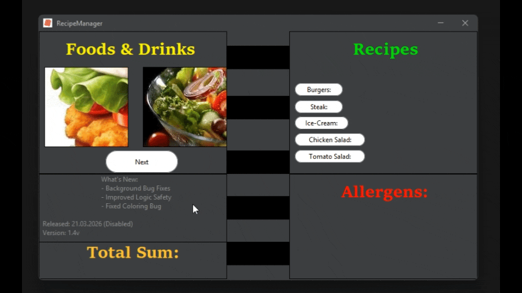
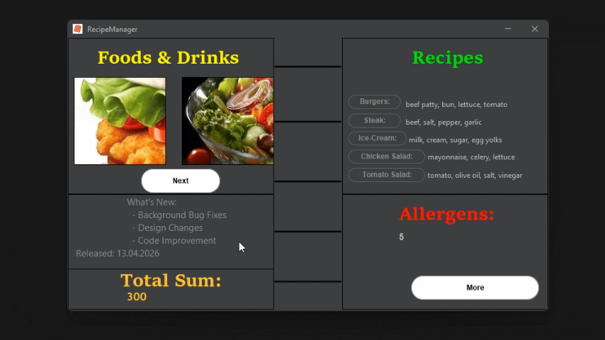
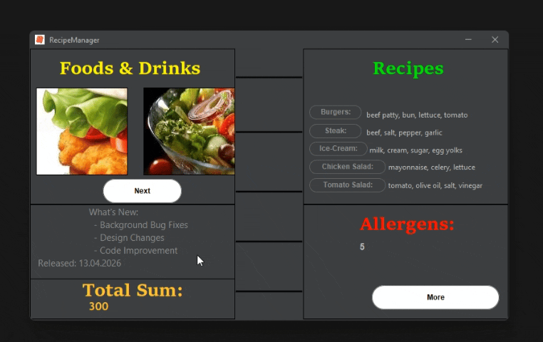
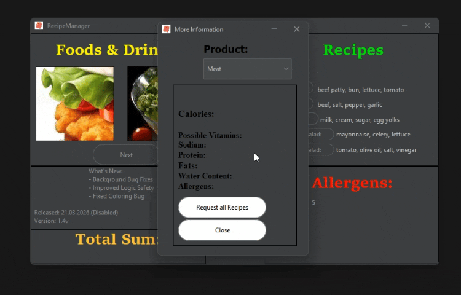

**RecipeManager is a small Desktop app which lets users select a few foods, check their Recipes, possible Allergen amount, Nutritional Information and even request them into a file.
this Application provides a basic example of how Restaurants can make simple and clear UI for their users to order a specific food.**
              

                  <b>Latest version is RecipeManager v1.5!</b> 
                  <b>Consider choosing latest version for best user experience.</b> 
                  <b>Go to Releases -> Choose RecipeManager v1.5 -> Download jar</b>

  # History of the RecipeManager:
   This development started in Early October of 2025, when one person in Java 'Help group' was searching for a help for their coursework.
   They had to build an App which lets users to choose a few foods, But many helpers in group ignored their message for days and even didn't answer it for days.
   I reached out to them respectfully and I started Development after we agreed and finished it 3 days early (October 27th) until the Deadline, October 30nd of 2025.
   But they have not reached out on that day, But They replied only on November 9th of 2025, about hand-over and they've said that what I have done is sufficient.
   I agreed on handing over, However I wanted to discuss a details, but after the last message of mine, they have not replied at all, its been 170+ days.

  # How was the app made:
   RecipeManager is made trough the Java SE, it uses Java Swing (in-built framework for GUI, part of the Java Fundation Classes), for Components and window that you see, it uses FlatLaf library for a Better, Modern Look & Feel to the users. Java's Sound API is involved to handle the Sounds. Action Handling/Additional Features for GUI comes from Java AWT (Abstract Window Tookit) 
  ### How it ended up:
   the app now has became mine, I still maintain it up to this day and improve it gradually. The Source code isn't being shared with them and Last Development video link which
   I provided to them through Mediafire is expired.
 
  **How to use RecipeManager:** 
    Make sure that you have a Latest JDK Installed -> Go to 'Releases' section of the Repo -> navigate to Latest Release -> Download jar files there and run it.
  ### License
This project is licensed under the GNU General Public License v3.0 (GPLv3) - see the LICENSE file for details.

     
    **Important!**
        RecipeManager is NOT an Enterprise Project, It is a small, demonstrational app built for experience-gaining purposes.
      I had a specific goal to develop following App in this way. It is not intended for Enterprise operations, just portfolio-oritented build.

* Demonstration: 👇
* Startup loading bar 📶:
  
* Choose food products 🍔:
  
* Automatic Screen Cleanup 🧽:
  
* More Information Tab 📜:
  
* Sneaky Close Button Effect 📕:
  

  # RecipeManager development videos:
  - [RecipeManager App in Java | 28.10.2025](https://youtu.be/3FQSAhvBGP8)
  - [RecipeManager | Full showcase](https://youtu.be/U4Fb3SS24gE)
